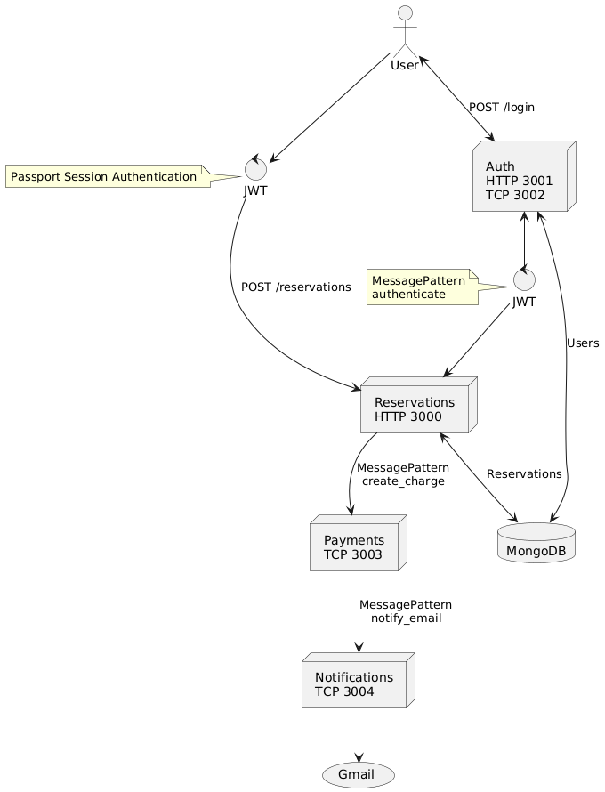

# RESRV

RESRV is a simple reservations API that was built to investigate distributed systems and microservices design patterns.

## Tech Stack

This project was written in TypeScript on NodeJs using the NestJS framework, containerized using Docker with Kubernetes, and deployed to Google Cloud.

### Languages / Frameworks

- TypeScript
- NodeJs
- NestJs
- Passport
- Bcrypt
- Stripe

### Database

- MongoDB / MongoDB Atlas

### CI/CD / Cloud

- Docker
- Kubernetes
- Google Cloud / Google Cloud Build

## Getting Started

Follow these steps to download and run the project locally.

### Pre-requisites

1. [Install Docker](https://docs.docker.com/engine/install/)
2. [Create a Stripe Account](https://docs.stripe.com/)
3. [Setup Google OAuth2 for Email](https://developers.google.com/identity/protocols/oauth2)\
4. [Install pnpm](https://pnpm.io/installation)

### Setting Up the Repository

1. Clone the repository into a local folder.

```
git clone https://github.com/oknott14/resrv.git
```

2. Cd into the _resrv_ folder: `cd ./resrv`
3. Install the app dependencies: `pnpm i -r`
4. Create _.env_ files for each of the 4 microservices.

```BASH
touch ./apps/auth/.env
touch ./apps/notifications/.env
touch ./apps/payments/.env
touch ./apps/reservations/.env
```

5. Populate each env file from the template in the microservice directory.

---

To add values to each env, use the _{microservice}.env.template_ files in the environment folder. Either copy the values to their respective templates or run the following commands:

```BASH
cat ./apps/auth/.ent.template > ./apps/auth/.env
cat ./apps/notifications/.env.template > ./apps/notifications/.env
cat ./apps/payments/.env.template > ./apps/payments/.env
cat ./apps/reservations/.env.template > ./apps/reservations/.env
```

The templates will add in all required non-sensitive env variables. Each .env file will need to have sensitive values, like the database uri or stripe secret key entered manually.

---

6. Run `docker compose up` to start all 4 microservices.

### Using the API

Using Postman, Curl, or a web browser, the API endpoints can be reached at http://localhost:3000 and http://localhost:3001.

## Design

RESRV has 4 microservices that communicate with eachother: Auth, Reservations, Notifications, and Payments. Each microservice is a standalone NestJS module following the Controller, Service, Repository Design Pattern.



### Authentication

The Auth microservice handles user login and authentication for the rest of the app. User's login by making a POST request to the http://localhost:3001/login endpoint with their user and password. If the password matches the encrypted stored password, then the user is authenticated and a session token is issued.

Every other route in the application uses an authentication guard ensuring that the request has a valid session token. If the token is invalid, the request is rejected with a 403 error. This guard requests the authentication microservice using the _Message Pattern_ and validates the token.

### Reservations

Reservations are created by making a POST request to http://localhost:3000/reservations. Before the reservation is created in the database, the reservations microservice requests the payment microservice using the _Message Pattern_ to validate the payment details provided by the user and charge their card. If the payment is valid, the reservation is stored in the database. Otherwise, the request is rejected with a 401 error.

### Payments

The payments microservice is responsble for using Stripe to validate payments and charge users for their reservations. Payments will pass the card information sent to it by _reservations_ to Stripe to validate and charge the card. If the card is valid, payments will request the _Notifications_ microservice to asynchronously send the user a payment / booking confirmation email using the _Event Pattern_.

### Notifications

The notifications microservice formats the reservation and confirmed payment data into an email template and sends it to the user via SMTP. The SMTP transport uses Google OAuth2 to autorize the app to send mail via your GMail account.